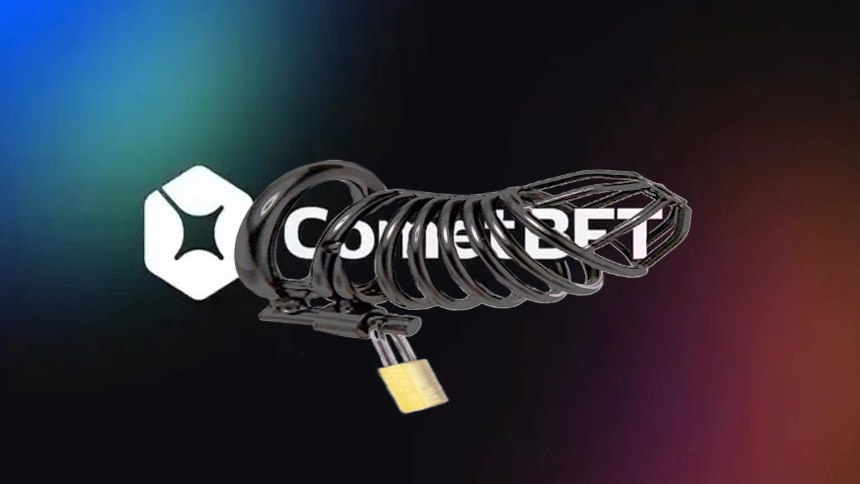

# CoCage

CoCage is Cosmos SDK Data Availability/Data Publication Module. It is a module that enables on-chain verification of 
published data by an external network such as Celestia. Validators continually run a side-car process(light client) 
that samples the published blocks on the external network. They then employ vote extensions to attest to data 
commitments (merkle roots) over the data published by the external network.

## Motivation

CoCage is foundation for future fraud-provable IBC bridging. In order for Cosmos to be able to bridge to other chains 
and Rollups in trust minimized way, it needs to be able to verify the data published by those chains. The goal of CoCage
is to provide a reusable module that enables data publication verification for variety of publication networks. 

## Supported Networks

### Celestia

The first external network supported by CoCage is [Celestia](https://celestia.network/). Celestia is a first modular
DA/DP (Data Availability/Publication) network that provides a decentralized data availability layer for blockchains.

We use Rollkit's [Celestia OpenRPC API](https://github.com/rollkit/celestia-openrpc/) to query and sample data from the
Celestia's Light Node. We cannot depend on celestia-node's API directly, and we cannot embed LN in Validator process,
due to conflicting SDK versions/forks.
