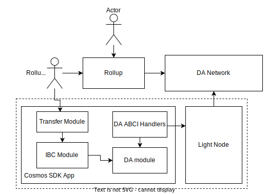

# CoCage

> This name is a placeholder and will be changed in the future. Currently, it's [a meme ref](https://x.com/jon_charb/status/1672086508637937664?s=20) and answer
> to [the question](https://x.com/nickwh8te/status/1682779788350566402?s=20).

CoCage is a lightweight Cosmos SDK Data Publication* (DP) Module. This enables on-chain verification of 
published data by an external network such as Celestia. Validators continually run a side-car process(light client) 
that samples the published blocks on the external network. They then employ vote extensions to attest to data 
commitments (merkle roots) over the data published by the external network.

**Data Publication is more commonly known as Data Availability although the term publication more accurately represents the problem.*

## Motivation

CoCage is a foundational component for **trust minimized proof-based IBC bridging** (as opposed to committee based). In order for Cosmos to be able to bridge to other chains 
and Rollups in trust minimized way, it needs to be able to verify the data published by those chains. The goal of CoCage
is to provide a reusable module that enables data publication verification for a variety of publication networks.

The original design was inspired by a collaboration between [Neutron](https://neutron.org/) and [Celestia](httsp://celestia.org). CoCage builds on top of Neutron's design and simplifies
it substantially.

## Use Case

To explain the utility of the system, it's best to explain the user flow of sending messages between a rollup and Cosmos SDK based chain. IBC relies on the ability to verify that a message has been correctly executed on a counterparty chain. For committee based chains this concretely means a quorum of validators signing over the `AppHash`. For rollups this means proof that the data was published as well as proof that the `AppHash` is valid (either a fraud proof or validity proof). An example of the flow is as follows:

- User submits a tx to the rollup sequencer. The sequencer includes the tx in the rollup block as well as a header with the app hash showing the tx successfully executed.
- The sequencer submits the rollup block to a DP Network like Celestia
- Celestia published the rollup block in one if its block
- The Cosmos SDK chain runs a DP light node that samples the block, validating that it has been published and is available
- While voting, the validator of that app includes as a vote extension the latest successfully sampled height
- The proposer for the following block uses the vote extensions to know what heights the other validators have sampled. If there are new blocks that aren't yet attested to, the proposer proposes them by including the data root of the Celestia block.
- Validators vote on the proposal. They reject it if they have not sampled the same heights or have different data roots. They accept it otherwise
- The block is committed and the new data roots are stored in the da module for the ibc module to access.
- A rollup relayer submits an IBC transaction including the rollups header (with the `AppHash`)
- The rollup relayer or another relayer includes either a validity proof or fraud proof. If there are no fraud proofs within a window, the chain trusts the rollups `AppHash`
- The transfer module can now use the `AppHash` to verify the part of the state that it is interested in.

## Design

### Vote Extensions

On every new block, validators check if their DP Light Node sampled any new DP network heights and if so they submit a vote
extension with the latest DP height sampled. We don't use VerifyVoteExtension, and we verify submitted heights in
PrepareProposal.

### Prepare Proposal

Proposer checks for vote extensions from previous height. If so, they find the latest
submitted DP height with +2/3 votes, get the data commitments for the heights sampled from their DP Light Node and 
propose them as a TX.

### Process Proposal

ProcessProposal then verifies the data commitments from against the DP network and if they are valid, it updates 
the state of Keeper.

### Keeper

Keeper stores the mapping between DP heights and respective data commitments, so that future modules and IBC client
can verify proofs against the commitments.

## Future Work

* Abstract the DP network interface, so that we can support multiple DP networks.
* Add support for IBC client to verify proofs against the DP network commitments.

## Supported Networks

### Celestia

The first external network supported by CoCage is [Celestia](https://celestia.network/). Celestia is a first modular
DA/DP (Data Availability/Publication) network that provides a decentralized data availability layer for blockchains.

We use Rollkit's [Celestia OpenRPC API](https://github.com/rollkit/celestia-openrpc/) to query and sample data from the
Celestia's Light Node. We cannot depend on celestia-node's API directly, and we cannot embed LN in Validator process,
due to conflicting SDK versions/forks.
